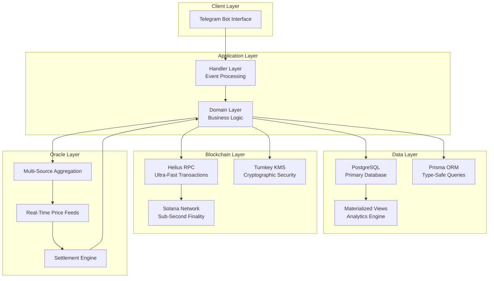
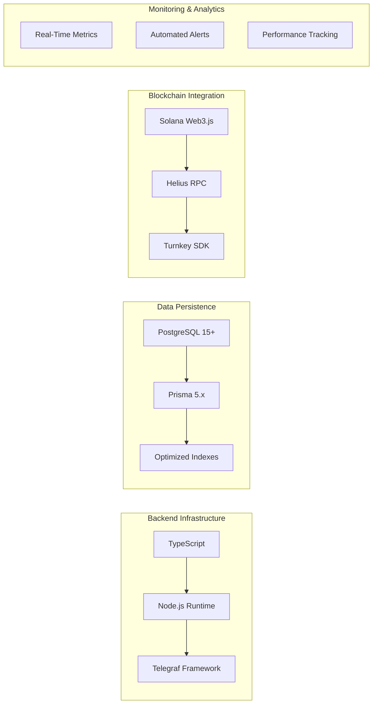

# Introduction

Welcome to ROOMS

ROOMS is the **first Telegram-native prediction market with instant settlement**, turning real-time crypto price movements into an **investable, liquid opportunity** for anyone with SOL.

By combining proprietary oracle infrastructure with parimutuel pools, we've created a platform that settles markets the **moment conditions are met** — bridging the massive gap of **delayed settlements and poor UX** that defines traditional prediction markets.

For the first time, anyone can bet on crypto prices with **enterprise-grade execution**, **military-grade security**, and **consumer-grade simplicity** — all without leaving Telegram.

## System Architecture Overview

## What Makes ROOMS Different

Traditional prediction markets suffer from slow settlements, poor UX, and limited market types. Users wait hours or days to know if they've won, interfaces are complex, and creating custom markets requires technical expertise.

ROOMS solves this with three core innovations:

**Instant Settlement Infrastructure** - Proprietary oracle system monitors markets 24/7 with millisecond precision. Markets settle the moment price targets are hit, not at scheduled times. Users receive push notifications with detailed payout information instantly.

**Enterprise Security Stack** - Built on Turnkey's Hardware Security Module (HSM) infrastructure for cryptographic operations. Private keys never touch application code. Multi-signature transaction approval with audit logging. Zero-trust architecture with real-time threat detection.

**Telegram-Native Design** - No apps to download, no complex interfaces. Everything works within Telegram with inline keyboards and conversational flows. Bet placement in 3 taps. Balance updates in real-time. Create custom markets in under 60 seconds.

## Core Infrastructure

ROOMS runs on a sophisticated multi-layer architecture designed for institutional-grade performance:

**Handler Layer** - Event-driven command processing with real-time state management. Processes all user interactions with sub-millisecond latency. Handles conversation state across async operations.

**Domain Layer** - Core business logic ensuring atomic operations and data integrity. Implements ACID guarantees across distributed systems. Manages rooms, bets, wallets, settlements, and referrals with repository pattern.

**Infrastructure Layer** - Blockchain integration via Helius RPC and proprietary oracle systems. Multi-region deployment with automatic failover. Connection pooling and rate limiting for external APIs.

**Security Layer** - Advanced key management with Turnkey HSM and zero-trust principles. Military-grade encryption for all operations. Byzantine fault-tolerant consensus for oracle data.

## Enterprise Technology Stack

The platform leverages TypeScript 5.3+ for type-safe code, Node.js 20 LTS for high-performance execution, and Telegraf 4.x for Telegram bot framework. Data persistence uses PostgreSQL 15+ with Prisma 5.x ORM for type-safe queries and optimized indexes. Blockchain integration via Solana Web3.js connects to Helius RPC infrastructure with Turnkey SDK for cryptographic operations.

## Performance Benchmarks

Sub-second response times across all operations (powered by Helius)  
Instant market settlement with guaranteed accuracy  
Secure wallet operations handling millions in volume  
99.9% uptime with automated failover systems  
3-second polling for token price updates  
Millisecond updates for major cryptocurrency pairs  
Sub-100ms failover on infrastructure issues  

## Market Opportunity

The prediction market industry is experiencing explosive growth, but remains fragmented and difficult to use. Traditional platforms like Polymarket require complex onboarding, have slow settlement times, and limited market types. 

ROOMS addresses this by:

1. **Removing Friction** - Telegram-native means no app installs, no KYC delays, instant access
2. **Instant Gratification** - Markets settle when targets are hit, not on arbitrary schedules  
3. **User Creation** - Anyone can create markets in 60 seconds with our guided flow
4. **Enterprise Security** - Turnkey HSM gives users confidence their funds are secure
5. **Solana Speed** - Sub-second finality means instant deposits and withdrawals

## Backed by Industry Leaders

ROOMS is built on enterprise infrastructure and supported by leading blockchain infrastructure providers:

**Helius** - Powered by Helius RPC infrastructure for ultra-fast Solana transaction processing. Dedicated nodes ensure 99.9% uptime and sub-second confirmation times.

**Turnkey** - Enterprise-grade key management and wallet security. Hardware Security Module (HSM) infrastructure ensures cryptographic operations never expose private keys.

**Solana Foundation** - Built on the fastest blockchain network in crypto. 65,000+ TPS capacity with 400ms block times enables instant settlements.

## Getting Started

New users can start betting in under 60 seconds:

1. Message the bot on Telegram
2. Wallet created automatically (secured by Turnkey)
3. Deposit SOL to provided address
4. Browse active rooms and place first bet
5. Receive instant notifications when market settles

For detailed instructions, see our [Quick Start Guide](getting-started/quick-start.md).

For understanding how the protocol works, explore [System Architecture](protocol-mechanics/system-architecture.md).

---

_Trusted by Helius • Powered by Turnkey • Built on Solana_
