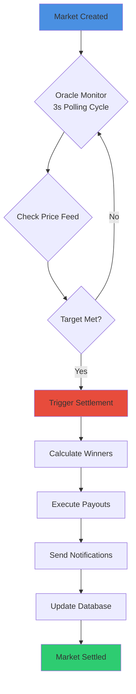
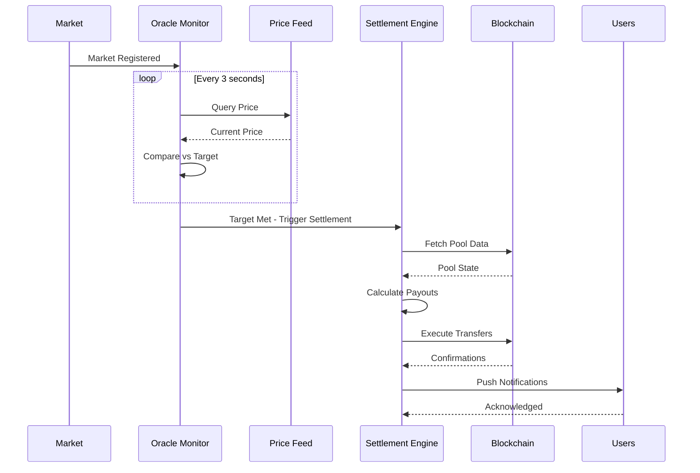
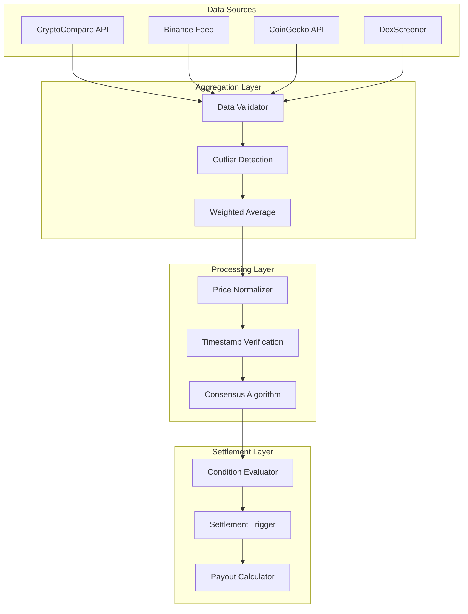

# Instant Settlement

## How It Works

ROOMS uses proprietary oracle infrastructure to monitor markets 24/7 and settle them instantly when conditions are met.

## Settlement Flow Architecture

### The Process

1. **Market Created** - User sets target (e.g., "SOL to $165")
2. **Oracle Monitoring** - System checks price every 3 seconds
3. **Target Detected** - Oracle detects when SOL hits $165
4. **Instant Settlement** - Market settles automatically
5. **Push Notification** - Users receive instant alerts
6. **Payout Distribution** - Winners receive SOL immediately

### No Waiting

Unlike traditional prediction markets:
- No waiting for scheduled settlement times
- No manual intervention required
- No delays or disputes
- Instant settlement when targets are hit
- Automatic payout distribution
- Real-time notifications

## Oracle Infrastructure

ROOMS uses custom oracle infrastructure:

**3-second polling** for Pump.fun tokens  
**Millisecond updates** for major cryptocurrencies  
**Multi-source aggregation** for reliability  
**Automatic failover** if one source fails  

## Settlement Types

### Price Targets
- "Will SOL reach $165?"
- Settles instantly when price hits target

### Market Cap Targets
- "Will $TOKEN hit $5M market cap?"
- Settles instantly when market cap reaches target

### Time-Based
- Markets can also settle at scheduled times
- Oracle still monitors for early settlement

## Transparency

All settlements are:
- **Recorded on-chain** - Verifiable by anyone
- **Transparent** - Settlement price is public
- **Automatic** - No human intervention
- **Fair** - Based solely on oracle data

---

_Trusted by Helius • Powered by Turnkey • Built on Solana_
