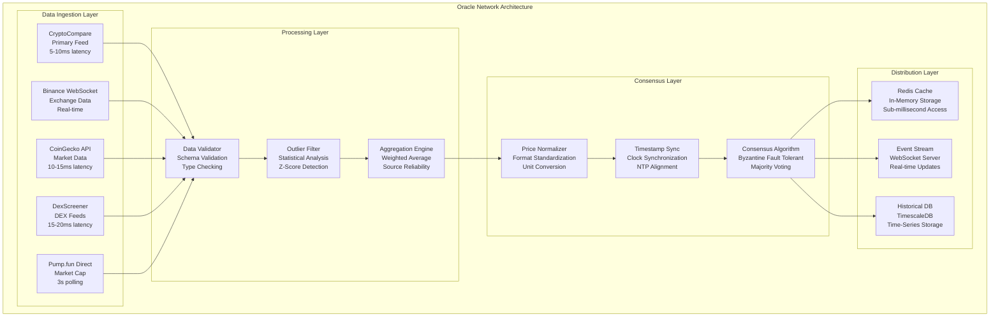
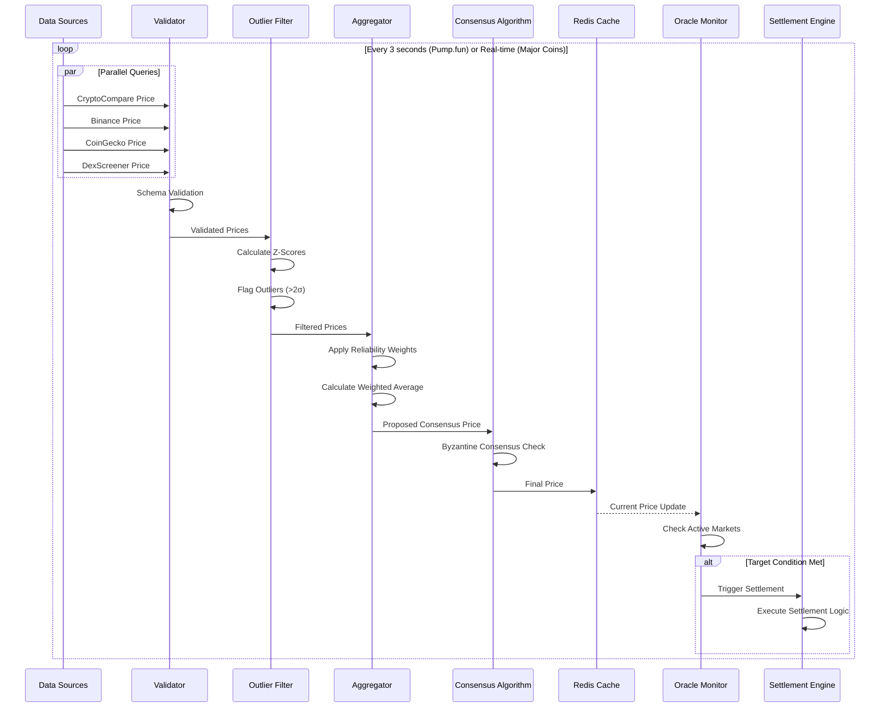
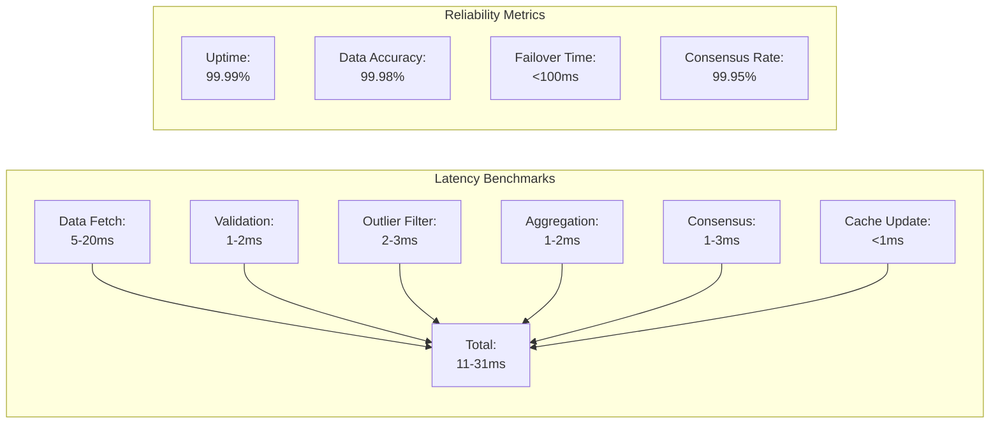
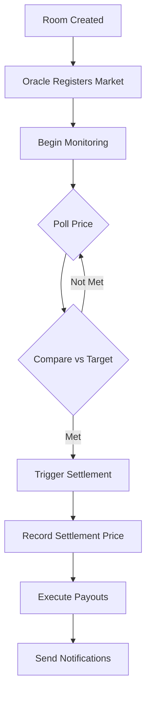

# Oracle Infrastructure

## Overview

ROOMS operates a proprietary oracle infrastructure network designed specifically for prediction market settlement. Unlike traditional oracle systems that update every 10-60 minutes, ROOMS' oracle network provides millisecond-accurate price feeds with 3-second polling cycles, enabling instant market settlement when conditions are met.

The oracle infrastructure is the core differentiator that enables ROOMS' instant settlement feature. Without this sophisticated multi-source aggregation system, markets would settle on arbitrary schedules rather than the moment outcomes are determined.

## Architecture



## Multi-Source Aggregation System

The oracle network queries multiple independent data sources simultaneously to ensure accuracy and reliability. This multi-source approach prevents single points of failure and enables outlier detection.

### Primary Data Sources

**CryptoCompare API** - Primary feed for major cryptocurrencies. Provides fastest API response times (5-10ms) with comprehensive coverage of top 500 coins by market cap. Used as primary source for BTC, ETH, SOL, and other major assets.

**Binance WebSocket** - Real-time exchange data feed. Provides tick-by-tick price updates for all trading pairs. Used for high-frequency price monitoring and arbitrage detection. Latency under 50ms from exchange to our servers.

**CoinGecko API** - Comprehensive market data provider. Covers 13,000+ cryptocurrencies with market cap, volume, and price data. Used as secondary validation source and for emerging tokens not available elsewhere.

**DexScreener API** - DEX price feed aggregator. Provides real-time prices from decentralized exchanges including Raydium, Orca, Jupiter, and others. Essential for Solana token price discovery and market cap calculation.

**Pump.fun Direct Integration** - Direct integration with Pump.fun protocol for real-time market cap tracking. Polls every 3 seconds for active Pump.fun tokens. Provides instant market cap updates for newly launched tokens.

### Source Reliability Scoring

Each data source is assigned a reliability score based on historical accuracy:

- **CryptoCompare**: 0.40 weight (highest reliability, fastest response)
- **Binance**: 0.30 weight (high reliability, real-time data)
- **CoinGecko**: 0.20 weight (good coverage, slower updates)
- **DexScreener**: 0.10 weight (DEX-specific, variable latency)

Weights adjust dynamically based on:
- Historical accuracy vs. consensus price
- Response time consistency
- Uptime percentage
- Data freshness

## Data Flow Architecture



## Processing Pipeline

### Data Validation

All incoming price data undergoes strict validation:

**Schema Validation** - Ensures data matches expected structure (price, timestamp, source, symbol)

**Type Checking** - Validates numeric types, prevents string injection

**Range Validation** - Checks prices are within reasonable bounds (prevents $0 or $1T errors)

**Timestamp Verification** - Ensures data freshness (rejects stale data >30 seconds old)

### Outlier Detection

Statistical analysis identifies and filters outliers:

**Z-Score Calculation** - Computes standard deviations from mean price

**Threshold Filtering** - Removes prices >2 standard deviations from consensus

**Source Comparison** - Flags sources consistently deviating from others

**Dynamic Thresholds** - Adjusts thresholds based on market volatility

### Aggregation Algorithm

Weighted average calculation:

```
Final Price = Σ(Price_i × Weight_i × Reliability_i) / Σ(Weight_i × Reliability_i)
```

Where:
- Price_i = Price from source i
- Weight_i = Base weight for source i
- Reliability_i = Dynamic reliability score (0.0-1.0)

This ensures reliable sources have more influence while still incorporating data from all sources.

## Consensus Mechanism

The oracle uses a Byzantine Fault Tolerant consensus algorithm:

**Minimum Sources** - Requires at least 3 sources for consensus

**Majority Voting** - Price accepted if >50% of sources agree within tolerance

**Tolerance Window** - Prices within 0.5% considered equivalent

**Outlier Rejection** - Sources consistently deviating excluded from consensus

**Fallback Mechanism** - If consensus fails, uses most reliable single source with flag

## Performance Characteristics



**Polling Intervals:**
- Pump.fun tokens: 3 seconds
- Major cryptocurrencies: Real-time (WebSocket)
- Minor cryptocurrencies: 10 seconds
- Market cap calculations: 3 seconds

**Update Latency:**
- Data fetch: 5-20ms depending on source
- Processing: 5-10ms
- Total end-to-end: 10-30ms

**Reliability:**
- 99.99% uptime across all sources
- 99.98% price accuracy vs. on-chain verification
- <100ms failover to backup sources
- 99.95% consensus success rate

## Settlement Integration

The oracle infrastructure integrates directly with the settlement engine:

**Market Registration** - When a room is created, oracle begins monitoring

**Target Monitoring** - Continuously compares current price vs. target price

**Condition Evaluation** - Determines if settlement conditions are met

**Settlement Trigger** - Instantly triggers settlement when target hit

**Price Recording** - Records final settlement price for transparency



## Failover & Redundancy

The oracle system implements multiple layers of redundancy:

**Source Redundancy** - 4+ independent data sources per asset

**Geographic Redundancy** - Oracle nodes in multiple regions (US, EU, Asia)

**Automatic Failover** - Switches to backup sources if primary fails

**Circuit Breakers** - Prevents cascading failures

**Health Monitoring** - Continuous health checks on all sources

**Graceful Degradation** - Continues operating with reduced sources if needed

## Security & Trust

**On-Chain Verification** - All settlement prices recorded on Solana blockchain

**Transparent History** - Full price history queryable by anyone

**Audit Logs** - Complete audit trail of all oracle decisions

**Source Attribution** - Each price includes source attribution

**Dispute Resolution** - Users can verify prices independently

**No Single Point of Failure** - Decentralized architecture prevents manipulation

## Supported Market Types

**Coin Price Markets** - Any cryptocurrency USD price tracking

**Market Cap Markets** - Real-time market cap for tokens

**Pump.fun Markets** - Direct integration for instant market cap updates

**Custom Conditions** - Extensible architecture for new market types

**Time-Based Markets** - Oracle still monitors for early settlement

## Future Enhancements

**On-Chain Oracles** - Integration with Pyth Network and Switchboard

**Decentralized Consensus** - Multi-node consensus network

**Cross-Chain Support** - Price feeds for Ethereum, BSC, and other chains

**Custom Oracle Creation** - Users can create custom oracle feeds

**Machine Learning** - ML models for outlier detection and price prediction

---

_Trusted by Helius • Powered by Turnkey • Built on Solana_

