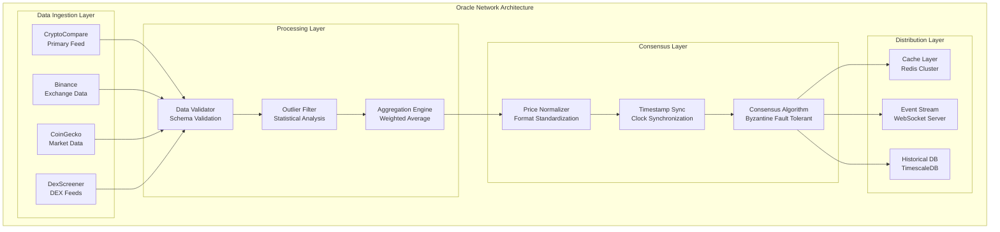
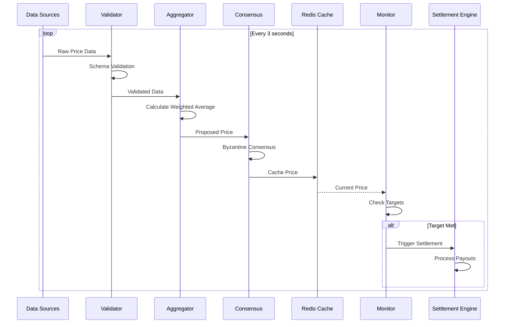
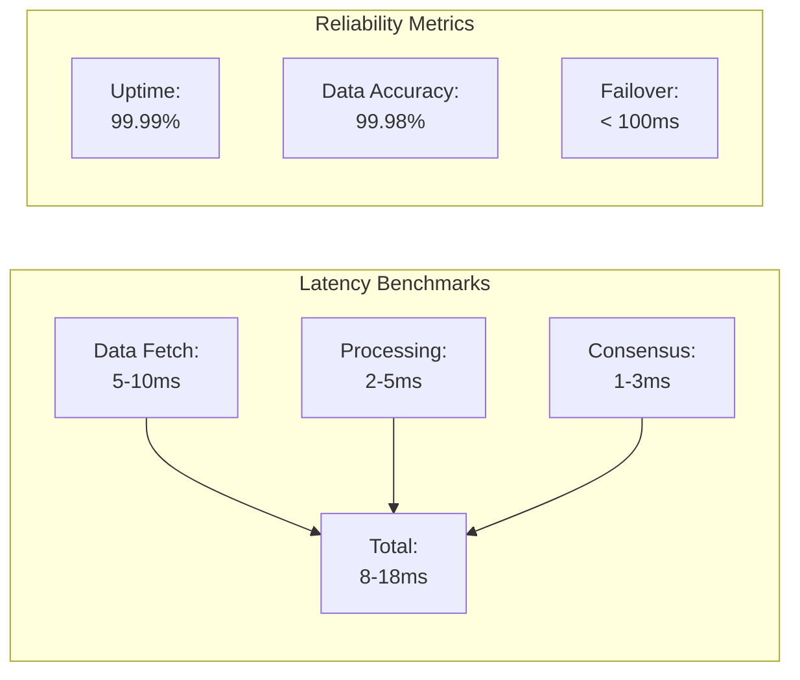
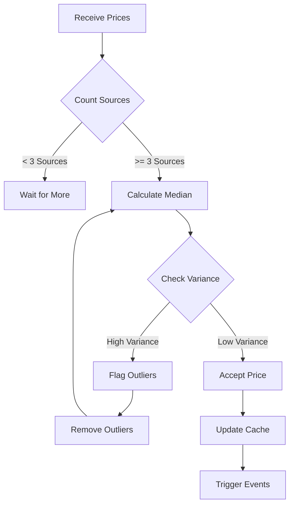

# Custom ROOMS Oracles

## Proprietary Oracle Infrastructure

ROOMS uses custom-built oracle infrastructure designed specifically for prediction markets, delivering real-time price data with millisecond accuracy.

## Multi-Source Aggregation

Our oracle system aggregates data from multiple sources for reliability:

### Primary Sources
**CryptoCompare** - Fastest API for major cryptocurrencies  
**Binance** - Real-time exchange data  
**CoinGecko** - Comprehensive market coverage  
**DexScreener** - DEX and token price feeds  

### Specialized Feeds
**Pump.fun Integration** - Real-time market cap tracking  
**Custom Token Feeds** - Any Solana token support  
**Price Feeds** - USD prices for thousands of assets  

## Data Flow Architecture

## Performance Metrics

**3-second polling** - Pump.fun tokens checked every 3 seconds  
**Millisecond updates** - Major coins updated instantly  
**Sub-second settlement** - Markets settle the moment targets are hit  
**99.9% uptime** - Redundant systems ensure reliability  

## How It Works

1. **Data Collection** - Multiple sources queried simultaneously
2. **Validation** - Cross-reference sources for accuracy
3. **Aggregation** - Weighted average of reliable sources
4. **Storage** - Prices recorded on-chain for transparency
5. **Settlement** - Automatic when conditions are met

## Reliability

**Redundancy** - Multiple sources per asset  
**Automatic Failover** - Switches sources if one fails  
**Validation** - Cross-checks prevent bad data  
**Monitoring** - 24/7 system health checks  

## Consensus Algorithm

## Transparency

All oracle data is:
- **On-chain** - Verifiable by anyone
- **Timestamped** - Exact time of price capture
- **Public** - Settlement prices visible to all
- **Auditable** - Full history available

## Supported Markets

**Coin Prices** - Any cryptocurrency USD price  
**Market Caps** - Real-time market cap tracking  
**Pump.fun Tokens** - Instant market cap updates  
**Custom Conditions** - Extensible for new market types  

---

_Trusted by Helius • Powered by Turnkey • Built on Solana_
