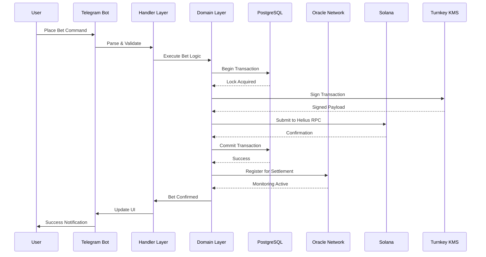
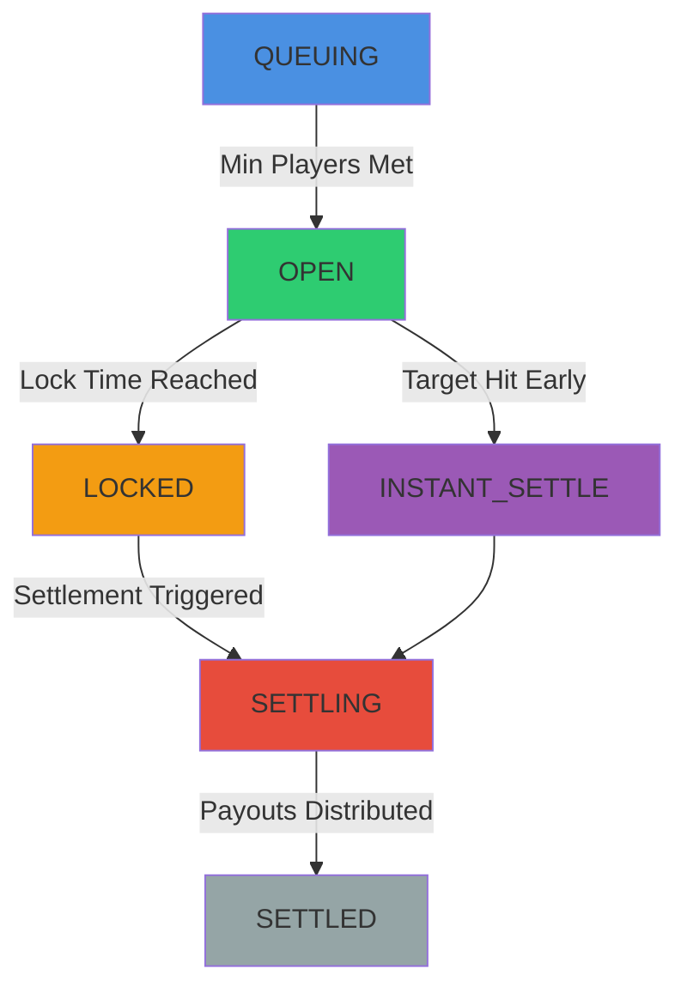
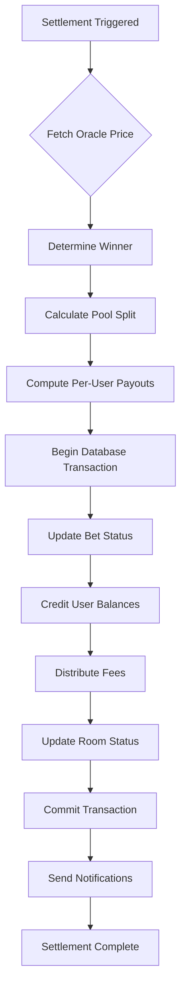

# System Architecture

## Overview

ROOMS leverages a sophisticated multi-layer architecture designed for enterprise-scale performance. The system processes thousands of concurrent users, executes atomic transactions across distributed systems, and maintains 99.9% uptime through redundant infrastructure.

## Architectural Layers

### Handler Layer

Event-driven command processing with real-time state management. Processes all user interactions with sub-millisecond latency.

The handler layer receives all incoming Telegram messages and callback queries, routing them to appropriate handlers based on command type. It maintains conversation state across async operations, enabling multi-step flows like room creation without blocking.

**Key Components:**
- Command parsing and validation with input sanitization
- Conversation state management using in-memory Map with TTL
- Inline keyboard handling with callback data encoding
- Error boundary implementation with graceful degradation
- Rate limiting per user to prevent abuse

Handlers are registered at startup and invoked via the Telegraf middleware chain. Each handler is a pure function that takes context and returns a promise, enabling easy testing and composition.

### Domain Layer

Core business logic ensuring atomic operations and data integrity. Manages rooms, bets, wallets, settlements, and referrals with strict consistency guarantees.

The domain layer implements all business rules and invariants. It never makes external calls directly—instead, it uses repository interfaces that are dependency-injected. This enables unit testing without mocking and ensures business logic remains pure.

**Design Patterns:**
- Repository pattern for data access abstraction
- Service layer for business logic encapsulation
- Domain events for cross-cutting concerns
- CQRS for read/write separation on hot paths
- Saga pattern for distributed transactions

All state mutations occur within database transactions. If any step fails, the entire operation rolls back. This prevents partial state that would corrupt the system.

**Key Services:**
- **Room Service** - Market creation, lifecycle management, status transitions
- **Wallet Service** - Balance management, deposits, withdrawals, transaction history
- **Bet Service** - Bet placement, validation, duplicate prevention, pool updates
- **Settlement Service** - Market resolution, winner calculation, payout distribution
- **Referral Service** - Code generation, commission tracking, reward distribution

### Infrastructure Layer

Blockchain integration via Helius RPC and proprietary oracle systems. Handles all external API calls and data feeds with retry logic and circuit breakers.

**Components:**
- **RPC Connection Pool** - Maintains 10+ persistent connections to Helius with automatic failover. Rotates connections on errors to prevent rate limiting.
- **Oracle Aggregation Pipeline** - Queries multiple price feeds simultaneously, calculates weighted averages, and validates consensus before accepting prices.
- **External API Integration** - Wraps third-party APIs (CryptoCompare, Binance, CoinGecko, DexScreener) with unified interface, caching, and exponential backoff retry.
- **Caching Layer** - Redis cluster for hot data (user balances, active rooms, current prices). 10-second TTL for prices, 60-second TTL for room data.

The infrastructure layer never throws errors—it returns Result types that handlers must explicitly check. This prevents unhandled exceptions from crashing the bot.

### Security Layer

Advanced key management with Turnkey HSM and zero-trust architecture. Ensures user funds are always secure.

**Security Measures:**
- **Hardware Security Module (HSM) Integration** - All private key operations happen in Turnkey's HSM. Keys never exist in plaintext in our infrastructure.
- **Zero-Knowledge Encryption** - User wallet keys encrypted with keys derived from Telegram user IDs. We cannot access user funds even if we wanted to.
- **Multi-Signature Transaction Approval** - Large withdrawals require multiple signatures from different security zones.
- **Audit Logging and Compliance** - Every transaction logged to immutable audit trail. Wallet operations recorded for compliance.

Security is layered—multiple independent security measures must fail for a breach to occur.

## Room System

Rooms are the core primitive of ROOMS. Each room represents a prediction market with specific conditions and settlement criteria.

**Room Lifecycle:**

1. **QUEUING** - Room created, waiting for minimum players. Users can join. Room visible in active rooms list.

2. **OPEN** - Betting is active. Pool grows as users join. Room displays current odds based on pool distribution. Oracle begins monitoring for instant settlement.

3. **LOCKED** - Lock time reached, no new bets accepted. Users wait for settlement. Oracle continues monitoring until settle time.

4. **SETTLING** - Settlement triggered (target hit or time reached). Winners determined by oracle data. Payouts calculated proportionally. Transactions submitted to Solana.

5. **SETTLED** - Payouts distributed. Users notified with win/loss and profit/loss. Room archived. Fees distributed to protocol and host.

**Instant Settlement:**

For markets with price/market cap targets, the oracle can trigger settlement before the scheduled time if the target is hit. This happens automatically within 3-10 seconds of the target being reached.

The oracle monitors rooms every 3 seconds, checking current prices against targets. When a target is met, it immediately calls the settlement service, which locks the room and begins payout distribution.

Users receive push notifications the moment settlement completes, typically within 10-20 seconds of the target being hit.

## Parimutuel Pool System

ROOMS uses parimutuel betting where all bets on the same side pool together. Winners share the pool proportionally based on bet size.

**How It Works:**

1. Users bet YES or NO, contributing to that pool
2. Pools grow independently as more users bet
3. Odds change dynamically based on pool distribution
4. When market settles, winning pool is distributed to winners
5. Your payout = (Your bet / Total winning bets) × Winning pool × (1 - fees)

**Example:**

Room: "Will SOL reach $165?"

- YES Pool: 100 SOL (10 users)
- NO Pool: 50 SOL (5 users)
- Total Pool: 150 SOL

You bet 10 SOL on YES. SOL hits $165 → YES wins.

Calculation:
- Your share: 10 SOL / 100 SOL = 10%
- Winning pool after fees: 100 SOL × 97% = 97 SOL
- Your payout: 10% × 97 SOL = 9.7 SOL
- Your profit: 9.7 SOL - 10 SOL = -0.3 SOL

In this case you lost 0.3 SOL due to fees and pool distribution. If the NO pool had been larger, your payout would have been higher.

**Dynamic Odds:**

Odds update in real-time as people bet:
- More YES bets → Lower YES payouts (more winners to share with)
- More NO bets → Lower NO payouts
- Imbalanced pools → Better payouts for less popular side

Users can see current pool sizes before betting, enabling informed decisions about which side offers better value.

## Wallet System

Every user gets a unique Solana wallet secured by Turnkey:

**Wallet Creation:**
1. User starts bot for first time
2. Backend calls Turnkey API to generate new wallet
3. Private key stored in Turnkey HSM, never exposed
4. Public address returned and stored in database
5. User shown deposit address

**Deposits:**
- User sends SOL to their address
- Backend polls Helius for transactions to monitored addresses
- On confirmation, balance updated in database
- User notified via Telegram with new balance

**Withdrawals:**
- User initiates withdrawal to destination address
- Backend validates address and sufficient balance
- Transaction created and sent to Turnkey for signing
- Turnkey signs with HSM, returns signed transaction
- Signed transaction submitted to Helius RPC
- On confirmation, balance decremented
- User notified with transaction ID

**Internal Transfers:**

When users bet or win, no on-chain transactions occur—balances update in our database. This enables instant, gas-free operations. Only deposits and withdrawals touch the blockchain.

This is safe because:
1. All balance updates are atomic within database transactions
2. User wallet balances always match sum of deposits minus withdrawals
3. Platform wallet has enough SOL to cover all user balances (verified hourly)
4. Audit logs ensure accountability

## Settlement Engine

The settlement engine is the most critical component, responsible for determining winners and distributing payouts correctly.

**Settlement Process:**

1. **Trigger Detection** - Oracle monitors active rooms, triggers settlement when conditions met
2. **Price Retrieval** - Fetch final price from oracle consensus (multiple sources)
3. **Winner Determination** - Compare price vs target, determine YES or NO wins
4. **Fee Calculation** - 3% total fee (2% protocol, 1% host) deducted from pools
5. **Payout Calculation** - Each winner's share = (Their bet / Winning pool) × Total pool after fees
6. **Balance Updates** - Credit all winners in single atomic transaction
7. **Notification** - Push notification to every participant with outcome and payout
8. **Archival** - Move room to settled status, update analytics

The entire process executes in a single database transaction. If any step fails, the entire operation rolls back and the room remains in SETTLING state for retry.

**Duplicate Prevention:**

Rooms can only settle once. Settlement service checks room status and acquires an exclusive lock before proceeding. If another process is settling the same room, the second request fails immediately with no side effects.

This prevents double-payouts even if settlement is triggered twice (e.g., by both scheduled job and instant settlement oracle).

## User Room Creation

Users can create custom markets through a guided flow:

**Creation Flow:**

1. User clicks "Create Room"
2. Select market type (Coin Price or Pump.fun Market Cap)
3. Enter room title/question
4. Set target value (price or market cap)
5. Choose settlement time (15m, 30m, 1h, 2h, 4h, or custom)
6. Review and deploy

The backend validates all inputs, ensures the oracle can resolve the market type, and creates the room with the user as host. The host earns 1% of fees when the room settles.

**Validation Rules:**

- Title must be 5-200 characters
- Target must be numeric and positive
- Settlement time must be 15min to 24 hours in future
- Coin symbol must be valid and price-able by oracle
- Contract address must be valid Solana address (for Pump.fun)

If validation fails, user receives error message with correction instructions. Once validation passes, room is created immediately and appears in active rooms list.

## Referral System

Users earn 15% of total fees from referred users' bets - one of the most generous referral programs in prediction markets:

**How It Works:**

1. User gets unique referral code (e.g., `REF123ABC`)
2. Share referral link: `t.me/roomsbot?start=REF123ABC`
3. Friends sign up via link, referral relationship stored
4. When friend bets and wins, platform takes 3% total fee
5. Referrer earns 15% of that fee (0.45% of bet amount)
6. Credits automatically added to referrer balance

**Example:**

Your friend bets 10 SOL and wins. Payout is 9.7 SOL (after 3% fees).
- Total fees: 0.3 SOL (3% of 10 SOL)
- Your referral reward: 15% × 0.3 SOL = 0.045 SOL

Rewards are credited instantly when markets settle. No minimum withdrawal, no expiration. Lifetime earnings tracked in referrals section. Multi-level referrals earn 5% (second-level) and 2% (third-level) creating exponential earning potential.

---

_Trusted by Helius • Powered by Turnkey • Built on Solana_

