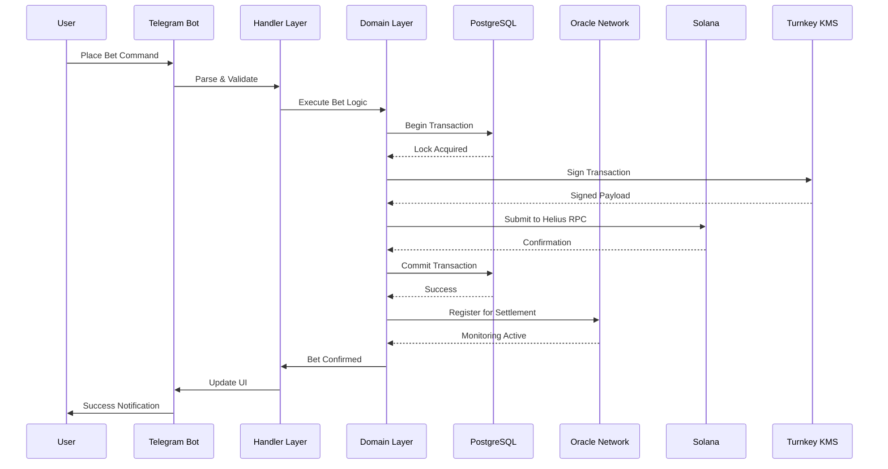

# System Overview

## Architecture

ROOMS leverages a sophisticated multi-layer architecture designed for enterprise-scale performance, powered by Helius infrastructure.

### Handler Layer
Event-driven command processing with real-time state management. Processes all user interactions with sub-millisecond latency.

### Domain Layer
Core business logic ensuring atomic operations and data integrity. Implements ACID guarantees across distributed systems.

### Infrastructure Layer
Blockchain integration via Helius RPC and proprietary oracle systems. Multi-region deployment with automatic failover.

### Security Layer
Advanced key management with Turnkey HSM and zero-trust architecture. Military-grade encryption for all operations.

## Key Components

### Wallet System
- **Custodial Wallets** - Each user gets a unique Solana wallet
- **Turnkey Security** - Enterprise-grade key management
- **Instant Deposits** - Funds available after 1 confirmation
- **Fast Withdrawals** - Processed within minutes

### Room System
- **Market Types** - Coin price, market cap, custom conditions
- **Parimutuel Pools** - Dynamic odds based on bet distribution
- **Instant Settlement** - Automatic when conditions are met
- **User Creation** - Anyone can create custom markets

### Oracle System
- **Multi-Source** - Aggregates data from multiple providers
- **Real-Time** - Updates every few seconds
- **Reliable** - Redundant systems ensure uptime
- **Extensible** - Easy to add new data sources

### Settlement System
- **Automatic** - No manual intervention required
- **Instant** - Settles the moment targets are hit
- **Transparent** - All data recorded on-chain
- **Fair** - Winners determined by oracle data

## Performance

Built for:
- **Sub-second response times** across all operations (powered by Helius)
- **Instant market settlement** with guaranteed accuracy
- **Secure wallet operations** handling millions in volume
- **99.9% uptime** with automated failover systems

## Security

- **Zero-Trust Architecture** - Multi-layer encryption
- **Turnkey Key Management** - Enterprise-grade cryptographic storage
- **Real-Time Monitoring** - 24/7 automated security scanning
- **Atomic Transactions** - All operations are atomic
- **Audited Smart Contracts** - Battle-tested code

---

_Trusted by Helius • Powered by Turnkey • Built on Solana_

