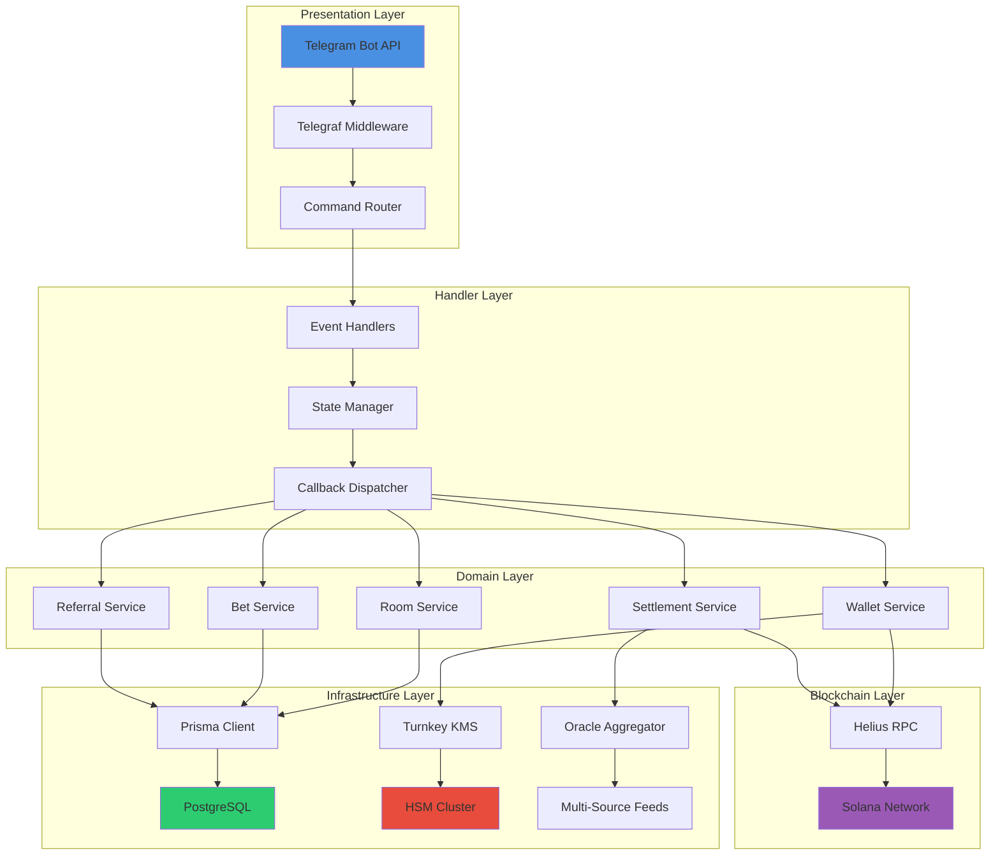
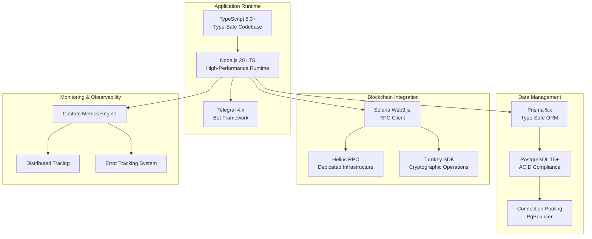

# Architecture & Security

## System Architecture

ROOMS leverages a sophisticated multi-layer architecture designed for enterprise-scale performance and security.

## Architectural Layers

### Handler Layer

Event-driven command processing with real-time state management. Processes all Telegram interactions with sub-millisecond latency.

**Key Components:**
- Command parsing and validation with input sanitization
- Conversation state management using in-memory Map with TTL
- Inline keyboard handling with callback data encoding
- Error boundary implementation with graceful degradation
- Rate limiting per user to prevent abuse

Handlers are registered at startup and invoked via the Telegraf middleware chain. Each handler is a pure function that takes context and returns a promise, enabling easy testing and composition.

### Domain Layer

Core business logic ensuring atomic operations and data integrity. Manages rooms, bets, wallets, settlements, and referrals with strict consistency guarantees.

**Design Patterns:**
- Repository pattern for data access abstraction
- Service layer for business logic encapsulation
- Domain events for cross-cutting concerns
- CQRS for read/write separation on hot paths
- Saga pattern for distributed transactions

All state mutations occur within database transactions. If any step fails, the entire operation rolls back. This prevents partial state that would corrupt the system.

### Infrastructure Layer

Blockchain integration via Helius RPC and proprietary oracle systems. Handles all external API calls and data feeds with retry logic and circuit breakers.

**Components:**
- RPC connection pool management (10+ persistent connections)
- Oracle data aggregation pipeline with multi-source validation
- External API integration layer with unified interface
- Caching and rate limiting (Redis cluster for hot data)

The infrastructure layer never throws errors—it returns Result types that handlers must explicitly check. This prevents unhandled exceptions from crashing the bot.

### Security Layer

Advanced key management with Turnkey HSM and zero-trust architecture. Ensures user funds are always secure.

**Security Measures:**
- Hardware Security Module (HSM) integration via Turnkey
- Zero-knowledge encryption (keys never exposed)
- Multi-signature transaction approval for large withdrawals
- Audit logging and compliance (immutable audit trail)

Security is layered—multiple independent security measures must fail for a breach to occur.

## Technology Stack

## Security Architecture

### Key Management

**Turnkey HSM Integration:**
- All private keys stored in Hardware Security Modules
- Keys never exist in plaintext in our infrastructure
- Cryptographic operations happen in secure enclaves
- Multi-signature approval for sensitive operations

**Zero-Knowledge Architecture:**
- We cannot access user funds even if we wanted to
- Private keys encrypted with keys derived from Telegram user IDs
- No single point of failure for key storage
- Keys recoverable only with proper authentication

### Transaction Safety

**Atomic Operations:**
- All database operations are atomic
- Prevents partial failures
- Ensures data consistency
- Rollback on errors

**Duplicate Prevention:**
- One bet per user per room enforced at database level
- Transaction deduplication prevents double-spending
- Idempotent operations ensure safety on retries
- Race condition protection via database locks

### Infrastructure Security

**Zero-Trust Architecture:**
- Multi-layer encryption (at rest and in transit)
- No single point of failure
- Defense in depth strategy
- Continuous monitoring

**Real-Time Monitoring:**
- 24/7 automated security scanning
- Threat detection and alerting
- Anomaly detection for unusual patterns
- Incident response procedures

### Smart Contract Security

**Audited Code:**
- Battle-tested smart contracts
- Security audits completed by third parties
- Bug bounty program for ongoing security
- Regular security updates

**On-Chain Verification:**
- All settlements verifiable on-chain
- Transparent transaction history
- Immutable records
- Public audit trail

## Performance Characteristics

**Sub-second response times** across all operations (powered by Helius)  
**Instant market settlement** with guaranteed accuracy  
**Secure wallet operations** handling millions in volume  
**99.9% uptime** with automated failover systems  

## Deployment Architecture

**Docker** - Containerized deployment for consistency  
**Kubernetes** - Orchestration for scalability (optional)  
**Terraform** - Infrastructure as code for reproducibility  
**CI/CD** - Automated deployments with testing  

## Compliance & Auditing

**Data Protection:**
- User data encrypted at rest
- Minimal data collection (only what's necessary)
- GDPR-compliant data handling
- User data deletion on request

**Transparency:**
- Public settlement data
- Verifiable oracle prices
- Open-source components where possible
- Regular security disclosures

**Fairness:**
- No manipulation possible
- Oracle consensus prevents single-source errors
- Transparent fee structure
- Equal treatment for all users

---

_Trusted by Helius • Powered by Turnkey • Built on Solana_

