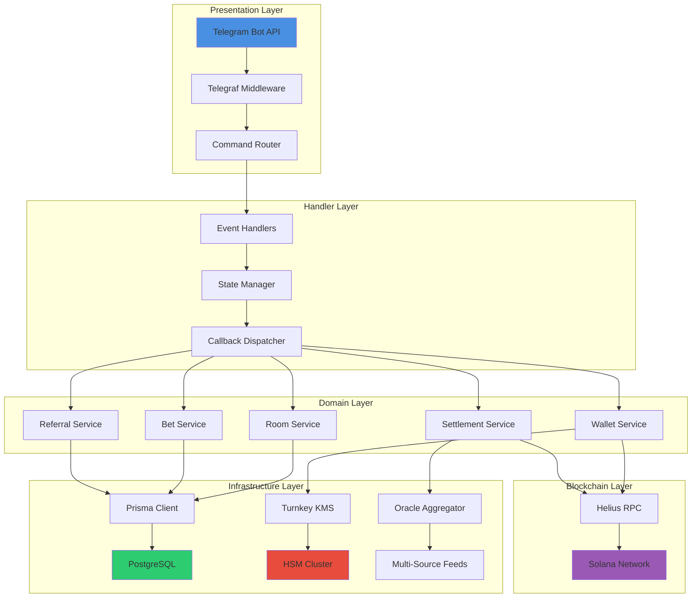
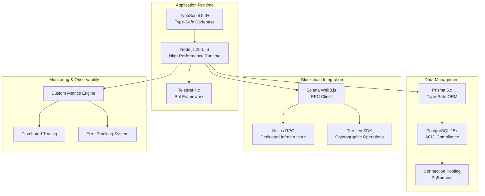

# Architecture

## System Architecture

ROOMS leverages a sophisticated multi-layer architecture designed for enterprise-scale performance.

## Architectural Layers

### Handler Layer
Event-driven command processing with real-time state management. Handles all Telegram interactions and user commands.

**Key Components:**
- Command parsing and validation
- Conversation state management
- Inline keyboard handling
- Error boundary implementation

### Domain Layer
Core business logic ensuring atomic operations and data integrity. Manages rooms, bets, wallets, settlements, and referrals.

**Design Patterns:**
- Repository pattern for data access
- Service layer for business logic
- Domain events for cross-cutting concerns
- CQRS for read/write separation

### Infrastructure Layer
Blockchain integration via Helius RPC and proprietary oracle systems. Handles all external API calls and data feeds.

**Components:**
- RPC connection pool management
- Oracle data aggregation pipeline
- External API integration layer
- Caching and rate limiting

### Security Layer
Advanced key management with Turnkey and zero-trust principles. Ensures user funds are always secure.

**Security Measures:**
- Hardware Security Module (HSM) integration
- Zero-knowledge encryption
- Multi-signature transaction approval
- Audit logging and compliance

## Technology Stack

## Infrastructure

### Database
- PostgreSQL for data persistence
- Prisma for type-safe queries
- Optimized indexes for performance
- Materialized views for analytics

### Blockchain
- Helius RPC for ultra-fast transactions
- Solana Web3.js for interactions
- Real-time transaction monitoring
- Automatic retry logic

### Oracles
- Multi-source price aggregation
- 3-second polling for tokens
- Millisecond updates for major coins
- Automatic failover systems

### Security
- Turnkey for key management
- Encrypted private keys
- Zero-knowledge architecture
- 24/7 monitoring

## Performance

- **Sub-second response times** (powered by Helius)
- **Instant market settlement**
- **99.9% uptime** with failover
- **Scalable** to millions of users

## Deployment

- **Docker** - Containerized deployment
- **Kubernetes** - Orchestration (optional)
- **Terraform** - Infrastructure as code
- **CI/CD** - Automated deployments

---

_Trusted by Helius • Powered by Turnkey • Built on Solana_

